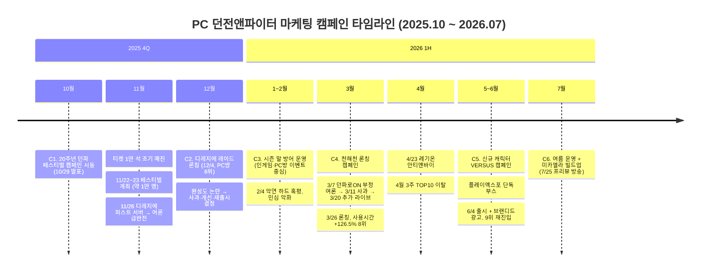

# 던전앤파이터(PC) 마케팅 캠페인 리뷰

**대상 기간: 2025년 10월 ~ 2026년 7월** | 작성일: 2026. 7. 23. | 작성 목적: 기간 내 마케팅 액션의 캠페인 단위 정리 및 성과 리뷰

---

## 1. 문서 개요

### 1.1. 작성 기준

- 본 문서는 PC 던전앤파이터(한국 서비스) 기준으로 작성하였으며, 던파 모바일·콘솔(카잔 등) 관련 액션은 범위에서 제외함.
- 액션 유형은 **광고 / PV(영상) / 오프라인 / 방송** 4개 유형을 기본으로 하되, 캠페인 이해에 필요한 인게임 프로모션·PC방 프로모션·커뮤니케이션(사과문 등)을 보조 유형으로 병기함.
- 반응은 **긍정(긍) / 부정(부) / 중립(중)** 3단계로 표기하고, 근거(언론 보도·커뮤니티 여론)를 함께 기재함.
- 정량 데이터는 **공개 출처(언론 보도, 게임트릭스·더로그 주간 집계, 넥슨 IR)로 확인된 수치만** 기재하였으며, 확인되지 않는 항목은 "확인 불가"로 명시하고 추정치를 넣지 않음.

### 1.2. 데이터 유의사항 (필독)

| 항목 | 유의사항 |
|---|---|
| PC방 지표 | 주차별 보도가 게임트릭스 기준과 더로그 기준이 혼재되어 있어 **절대치(사용시간)의 시점 간 직접 비교는 불가**. 순위·증감률·점유율(%) 등 상대 지표 중심으로 해석 필요 |
| 내부 지표 | 동시접속자·복귀 유저 수·매출 등 내부 데이터는 기간 내 공식 공개된 바 없음. 넥슨 분기 IR의 던파 언급은 중국 매출 비중이 커서 국내 PC 캠페인 성과 지표로 직접 사용 불가 |
| 시즌 구조 | '중천'은 2025. 1. 9. 시작된 시즌 10으로, 본 기간의 앞부분(25.10~26.3)은 **중천 시즌 후반부~말기**에 해당. 26. 3. 26. 시즌 11 '천해천'으로 전환됨 |

---

## 2. Executive Summary

- 기간 전체는 **6개 캠페인**으로 구분되며, 서사적으로는 "20주년 페스티벌의 긍정 피크 → 디레지에 레이드 완성도 논란과 시즌 말 민심 악화 → 천해천 론칭으로 반등 → 신규 캐릭터 캠페인으로 재반등 → 8월 미카엘라 빌드업"의 흐름임.
- 기간 내 확인된 마케팅 믹스는 **방송(쇼케이스·디렉터 라이브) + 오프라인(페스티벌·플레이엑스포) + PC방 프로모션 + 인게임 부스트/점핑**이 중심축이며, **TV·옥외 등 대규모 ATL 집행은 기간 내 확인되지 않음**. 광고 유형으로 확인된 것은 26년 6월 예능형 브랜디드 콘텐츠(조혜련 '신격권 다이어트')가 유일함.
- 정량적으로는 대형 콘텐츠 론칭 시점마다 PC방 지표의 단기 반등이 반복 확인됨: **디레지에(25.12) 6위 진입 → 시즌 말(26.1~2) 10위권 밖 이탈 흐름 → 천해천(26.3) 사용시간 +126.5%·8위 → 신캐(26.6) +50.5%·9위 재진입**. 다만 매 캠페인 후 3~4주 내 소강되는 **"스파이크 후 감쇠" 패턴**이 뚜렷함.
- 커뮤니케이션 리스크가 성과를 좌우한 기간이기도 함. 디레지에 퍼스트 서버(25.11)와 던파로ON 쇼케이스(26.3)에서 각각 부정 여론이 폭발했고, 두 번 모두 **공식 사과 → 개선안 제시 → 추가 방송**의 수습 수순을 거친 뒤에야 론칭 성과로 연결됨.

### 기간 전체 타임라인

---

## 3. 캠페인 총괄표

| # | 캠페인 | 기간 | 핵심 액션 유형 | 종합 반응 | 핵심 확인 지표 |
|---|---|---|---|---|---|
| C1 | 20주년 '2025 던파 페스티벌' | 25.10.29 ~ 11.23 | 오프라인, 방송, PV | **긍정** (행사) / 발표 내용은 혼재 | 티켓 1만 석 1분 내 매진, 방문 약 1만 명, PC방 9위(11월 4주, 점유율 2.03%) |
| C2 | '검은 질병의 디레지에' 레이드 론칭 | 25.11.26 ~ 12월 말 | 인게임, PC방, 커뮤니케이션 | **부정 우세** (연출·서사는 호평) | PC방 사용시간 +18.5%, 6위(12월 1주) |
| C3 | 중천 시즌 말 방어 운영 | 26.1 ~ 2월 | 인게임, PC방 | **중립~부정** (민심 악화 누적) | PC방 10위(1월 2주), 이후 TOP10 밖 |
| C4 | 시즌 11 '천해천' 론칭 | 26.3.2 ~ 4월 초 | 방송, PV, 인게임, PC방, 오프라인 | 방송 **부정** → 론칭 **긍정** | 사용시간 +126.5%, 13위→8위, 점유율 2.91%(3월 4주) |
| C5 | 신규 캐릭터 'VERSUS'(브레이커·인파이터) | 26.5.14 ~ 6월 | 방송, 오프라인, 광고, PV, PC방 | **긍정** | 사용시간 +50.5%, 9위 재진입(6월 1주) |
| C6 | 여름 시즌 운영 + '미카엘라' 빌드업 | 26.6 ~ 7월 (진행 중) | 인게임, PC방, 방송(예고) | **중립** | 7월 주간 TOP10 내 미확인 |

---

## 4. 캠페인별 상세

### C1. 서비스 20주년 '2025 던파 페스티벌' 캠페인 (25.10.29 ~ 11.23)

시즌 10 '중천'의 후반부, 8월 이후 공식 소통 공백에 대한 유저 불만이 누적되던 시점에서 20주년 기념 오프라인 행사를 앵커로 연말 모멘텀을 구축한 캠페인.

| 일자 | 액션 | 유형 | 내용 | 반응 |
|---|---|---|---|---|
| 10.29 | 페스티벌 개최 발표 | 보도자료 | 11/22~23 킨텍스 제2전시장, 20주년 기념 규모 예고. 플레이마켓(2차 창작), 콜라보 굿즈, 입장 기념품(5만 세라 포함) 공지 | 긍 |
| 10.30 | 아라드 어워즈 시즌2 / 아라드 패스 | 인게임(BM) | 아바타 판매(~12/31), '인형극단' 콤보 상자 | 중 |
| 11.7 | 티켓 오픈 | 오프라인 | 1인 1매 예매 — **1일차 1분·2일차 45초 만에 전석 매진(총 1만 석)** | 긍 |
| 11.22~23 | **2025 던파 페스티벌** 개최 | **오프라인 + 방송** | 킨텍스 2개 홀(역대 최대 규모). 1부 겨울 쇼케이스(박종민 총괄 디렉터, 던파TV·치지직 동시 생중계), 2부 20주년 콘서트·토크쇼·플레이마켓·아트 전시. 발표: 디레지에 레이드(12/4), 여프리스트 5차 전직 '인파이터', 신규 캐릭터 '제국기사', 신규 지역 '천해천'(26년 상반기) | 행사 긍 / 발표 혼재 |
| 11.22 | 디레지에 트레일러·신캐 소개 영상 | PV | 쇼케이스 내 공개 후 던파TV 게시 (개별 조회수 확인 불가) | 긍 |

- **반응 상세**: 행사 자체는 "성황리 종료" 보도 다수·약 1만 명 방문으로 긍정. 발표 내용은 디레지에 레이드 연출·제국기사 디자인 호평(긍), 여성 인파이터는 퀄리티 지적으로 냉랭(부).
- **확인 지표**: 11월 4주 PC방 주간 사용시간 전주 대비 **+25%**, 점유율 **2.03%**, **9위** (아이러브PC방). 온라인 중계 시청자 수는 확인 불가.
- **참고(IR)**: 11.11 넥슨 3분기 실적 발표에서 PC 던파(중국 포함) 매출 전년 동기 대비 +72%, 한국 지역 매출 +46% 언급 — 캠페인 성과라기보다 배경 지표.

### C2. '검은 질병의 디레지에' 레이드 론칭 캠페인 (25.11.26 ~ 12월 말)

중천 시즌의 대미를 장식하는 12인 레이드 론칭. 페스티벌로 끌어올린 기대감이 퍼스트 서버 완성도 논란으로 급반전되며, 론칭 캠페인이 위기 대응 커뮤니케이션으로 전환된 사례.

| 일자 | 액션 | 유형 | 내용 | 반응 |
|---|---|---|---|---|
| 11.26~12.3 | 퍼스트 서버 선공개 | 사전 테스트 | 선행 체험 서버에서 레이드 공개 | **부** — 버그·미완성 지적 확산, 페스티벌 직후 여론 반전 |
| 12.3 | 총괄 디렉터 공식 코멘트 | 커뮤니케이션 | 피드백 기반 대규모 개선안 + "안내와 반영이 늦어진 점" 사과 | 수습 시도 (여론은 냉랭) |
| 12.4 | 레이드 본 서버 론칭 | 인게임 + 프로모션 | 3개 난이도 오픈, 공식 프로모션 페이지 '디레지에를 저지하라!' 운영 | 부 우세 / 연출·서사는 호평 |
| 11.27~ | 윈터 페스티벌 이벤트 | 인게임 + PC방 | '윈터 부스트 업'(~26.2.26), 출석 보상, 20주년 회고 페이지, PC방 던전·레이드 추가 보상 연계 | 중~긍 |
| 12.11 | 레이드 개선 업데이트 | 커뮤니케이션 | 렉·QTE 패턴·부활 대기 개선. 이후 유저 만족 미달을 인정하고 **던파 최초의 '레이드 재출시' 결정** | 부→수습 |

- **확인 지표**: 12월 1주(12/1~7) PC방 사용시간 전주 대비 **+18.5%**, 2계단 상승 **6위** (더로그 기준). 콘텐츠 논란과 별개로 트래픽은 유입된 것으로 확인. 연말 결산에서 던파는 메이플과 함께 2025년 PC방 '최다 성장' 게임으로 언급됨.

### C3. 중천 시즌 말 방어 운영기 (26.1 ~ 2월)

신규 대형 액션 없이 인게임 이벤트와 PC방 프로모션으로 리텐션을 방어한 저활동 구간. 2월 '악연' 하드 레이드 혹평과 소통 부재 비판이 겹치며 언론에서 "시즌 말 이탈"이 기사화될 정도로 민심이 저점을 기록.

| 일자 | 액션 | 유형 | 내용 | 반응 |
|---|---|---|---|---|
| 1.8 | 다크템플러 리뉴얼 + 보급 작전 이벤트 | 인게임 | 직업 전면 리뉴얼 + 미션 보상 이벤트(~1.29) | 중 |
| 1월 | '추운 날씨에 열기를 더해줄 PC방' | PC방 | 접속·플레이타임 보상형 (세부 확인 불가) | 확인 불가 |
| 1.22~3.12 | '아르카나' 장기 이벤트 | 인게임 | 천해천 전까지의 리텐션 브릿지 | 중 |
| 2.4~5 | 디레지에 하드 '악연' 업데이트 | 인게임 | 고난도 외전 모드 | **부** — 보상 대비 요구 스펙 혹평, 밸런스 공지 소통 부재 비판, 이후 중국 서버 대비 내수차별 논란 |
| 2월 중하순 | (리스크) 시즌 말 민심 악화 | — | "1년간의 불만 폭발" 비판 기사·유튜브 확산. 상시 소통 창구 부재 지적 | 부 |

- **확인 지표**: 1월 2주 PC방 주간 **10위** 유지. 이후 4월 전까지 TOP10 내 수치 보도 미확인(사실상 이탈 추정이나 수치는 확인 불가).
- **배경**: 2025년 네오플 노조 파업(25.6~11)으로 20주년 행사 'DNF Universe 2025'가 취소되는 등 콘텐츠·소통 공백이 누적된 상태였음.

### C4. 시즌 11 '천해천 : 새로운 도약' 론칭 캠페인 (26.3.2 ~ 4월 초)

시즌 전환을 걸고 방송→사전 이벤트→론칭→PC방·오프라인 연계로 이어지는 정석적 론칭 퍼널을 가동. 다만 티징 방송이 오히려 부정 여론의 분출구가 되어, 사과와 추가 방송으로 수습한 뒤에야 론칭이 성과로 연결됨.

| 일자 | 액션 | 유형 | 내용 | 반응 |
|---|---|---|---|---|
| 3.2 | '던파로 ON : 천해천' 예고 | 보도자료 | 3/7 방송 예고, "분위기 반전" 프레임 보도 | 중(관망) |
| 3.7 | **'2026 던파로 ON : 천해천'** | **방송 + PV** | 던파TV·치지직 생중계. 천해천(3/26)·서약 파밍·상급던전·레기온(4/23)·미카엘라 레이드(8월) 로드맵 공개. **천해천 PV 방송 내 최초 공개** | **부** — 랜덤 재화·레이드 반복 강요·소통 부재에 대한 불만 분출("사퇴" 채팅 등), 재방송도 혹평 |
| 3.11 | 개발자 노트 공식 사과 | 커뮤니케이션 | 방송 내용·소통 방식 사과 | 수습 |
| 3.20 | 추가 라이브 방송 | 방송 | 퍼스트 서버 피드백 수용 내용 공유 | 중→완화 |
| 3월 중순 | 천해천 프리 이벤트 | 인게임 | 사전 보상 + 시즌 준비 가이드 | 중 |
| 3.26 | **천해천 론칭 + '부스트 업'** | 인게임 | 신규 지역·서약 파밍·상급던전 2종. 복귀/신규 대상 '천해천 부스트 업'(~6.4): 12강 8재련 레전더리 무기 등 장비 풀세트, 115Lv 점핑권 2매 | **긍** — 복귀 유저 대거 유입, 파밍 접근성 호평 (장비 밸런스 논란 병존) |
| 3.26~ | '천 개의 바다를 맞이하는 PC방' | PC방 | 신규·복귀 유저 **PC방 3시간 무료 이용권** | 긍 |
| 3.28~29 | 전국 거점 PC방 오프라인 이벤트 | 오프라인 | 비엔엠컴퍼니 협업 — 음료 증정, 테마 미니게임 '파핑특공대' | 중~긍 |

- **확인 지표**:
  - 론칭 당일(3.26) PC방 순위 전일 대비 5계단 상승 → **9위** 진입.
  - 3월 4주(3/23~29) 주간: 사용시간 **+126.5%**(453,474시간), **13위→8위**, 점유율 **2.91%**, '이주의 게임' 선정. 4월 초까지 2주 연속 상승.
  - 복귀 유저 절대치·동시접속: 확인 불가.
- **감쇠**: 4.23 레기온 '아포칼립스: 안티엔바이' 업데이트(반응 중립)에도 불구하고 **4월 3주 TOP10 이탈** — 론칭 스파이크 후 약 4주차 감쇠 패턴 재확인.

### C5. 신규 캐릭터 'VERSUS' 캠페인 — 브레이커·인파이터(여) (26.5.14 ~ 6월)

기간 내 마케팅 믹스가 가장 넓었던 캠페인. 방송(공개) → 오프라인(체험) → 출시 + 브랜디드 광고 + PC방 프로모션까지 4개 유형이 모두 가동됐고, 반응·지표 모두 양호.

| 일자 | 액션 | 유형 | 내용 | 반응 |
|---|---|---|---|---|
| 5.14 | 방송·행사 참가 발표 | 보도자료 | 5/20 방송 및 플레이엑스포 참가 공지 | 중 |
| 5.20 | **'D-Note Live'** | **방송** | 신규 캐릭터 '제국기사(브레이커)'·'인파이터(여)' 공개, 6/4 출시 확정. 앰버서더('낡은창고' 작가 캐릭터) 진행 + 박종민 총괄 디렉터 출연 | **긍** — 신캐 타격감 등 호응 보도 |
| 5.20~ | 스킬 정보·가이드 영상 | PV | 신캐 스킬 영상, 출시 후 공식 가이드 영상 연속 게시 (조회수 확인 불가) | 중 |
| 5.21~24 | **'던파 in 플레이엑스포 VERSUS'** | **오프라인** | 넥슨 최초 단일 IP 단독 부스(킨텍스). 신캐 2종 라이벌 구도, 드로잉쇼·퀴즈쇼·브금 월드컵·개발자 강연·포토존·굿즈 | **긍** — 개막 직후 긴 대기열, "대표 부스" 현장 보도 다수 |
| 6.4 | 신캐 2종 출시 + 썸머 페스티벌(~8.27) | 인게임 | '썸머 부스트 업', 100% 강화·증폭권 이벤트 등 성장 지원 패키지 | 긍 |
| 6.4 | **'조혜련과 함께하는 신격권 다이어트'** | **광고(브랜디드 예능)** | '태보 다이어트' 밈 패러디. 조혜련·성승헌 + 앰버서더 레바·보겸 + 스트리머 인섹·꼴랑이 출연, 인파이터 '신격권' 학습 콘셉트 | 긍~중 — 언론 다수 보도로 화제성 확보 (정량 반응 확인 불가) |
| 6.4~7.9 | '무더위 탈출! COOL Summer PC방' | PC방 | 경험치+10%·스킬+1·자판기 토큰, 프리미엄 PC방 전용 아바타 혜택. 이후 연장 프로모션 확인 | 중 |

- **확인 지표**: 6월 1주(6/1~7) PC방 사용시간 **+50.5%**(354,388시간), 5계단 상승 **9위, TOP10 재진입** (게임트릭스 기준 보도 포함). 이후 6월 2~4주 수치는 보도 미확인.

### C6. 여름 시즌 운영 + '성안의 미카엘라' 빌드업 (26.6 ~ 7월, 진행 중)

썸머 페스티벌 장기 이벤트로 리텐션을 유지하며 8월 신규 사도 레이드로 빌드업하는 구간.

| 일자 | 액션 | 유형 | 내용 | 반응 |
|---|---|---|---|---|
| 6월 초 | '던끼얏호우! 썸머 페스티벌 시작!' | PV | 시즌 홍보 영상 (조회수 확인 불가) | 중 |
| 7월 | 여름 라이브 이벤트 | 인게임 | '레미디아 여프료시카', '파도치는 폭권으로! 보급 작전'(~7.23) 등 | 중 |
| 7.25(예정) | '미카엘라 프리뷰' 방송 | 방송(예고) | 8월 신규 사도 레이드 '성안의 미카엘라' 사전 공개 | 중 — 입장 스펙 수준에 관심 집중 |

- **확인 지표**: 7월 1~3주 주간 PC방 TOP10 기사 내 던파 미언급(디아블로4·팰월드 중심) — 순위·점유율 확인 불가. **C2·C4의 전례상 미카엘라 프리뷰(7.25)~8월 론칭 구간의 사전 여론 관리가 3분기 지표의 관건.**

---

## 5. PC방 점유율/순위 변화 추이 (확인 데이터 한정)

> 집계사(게임트릭스/더로그)가 주차별로 혼재되어 있어 사용시간 절대치의 시점 간 비교는 유효하지 않음. **순위·증감률 중심으로 판독** 요망.

| 시점 | 순위 | 점유율 / 사용시간(주간) | 트리거 이벤트 |
|---|---|---|---|
| 25년 11월 4주 | 9위 | 2.03% / 61,342시간 (**+25%**) | 던파 페스티벌 쇼케이스 |
| 25년 12월 1주 | **6위** (▲2) | 사용시간 **+18.5%** | 디레지에 레이드 론칭(12/4) |
| 26년 1월 2주 | 10위 | 수치 확인 불가 | 시즌 말 소강 |
| 26년 2월 | TOP10 내 보도 없음 | 확인 불가 | 민심 악화 구간 |
| 26년 3월 26일(당일) | 9위 (▲5, 일간) | — | 천해천 론칭 |
| 26년 3월 4주 | **8위** (13위→8위) | 2.91% / 453,474시간 (**+126.5%**) | 천해천 + 부스트업 + PC방 무료 이용권 |
| 26년 4월 3주 | TOP10 이탈 | 확인 불가 | 론칭 효과 감쇠 |
| 26년 5월 | TOP10 내 보도 없음 | 확인 불가 | — |
| 26년 6월 1주 | **9위** (▲5, 재진입) | 354,388시간 (**+50.5%**) | 신캐 출시 + 썸머 페스티벌(6/4) |
| 26년 7월 1~3주 | TOP10 내 보도 없음 | 확인 불가 | — |

**판독**: 기간 내 던파의 PC방 지표는 "대형 업데이트 → 순위 5계단 내외 급등 → 3~4주차 TOP10 이탈"의 사이클을 3회(디레지에, 천해천, 신캐) 반복함. 캠페인의 순간 화력은 검증됐으나, 스파이크 사이의 체류 구간을 받쳐줄 미드텀 액션(정례 방송, 시즌 중반 이벤트의 외부 노출)이 상대적으로 비어 있음.

---

## 6. 종합 인사이트

1. **소통 리스크가 캠페인 ROI를 결정했다.** 페스티벌(C1)과 던파로ON(C4) 모두 대형 방송/행사 직후 부정 여론(퍼스트 서버 완성도, 랜덤 재화·소통 부재)이 분출했고, 수습(사과→개선→추가 방송)에 2~3주를 소모했다. 사전 검증(퍼스트 서버 품질 게이트)과 상시 소통 채널 정례화가 차기 캠페인의 선결 과제.
2. **ATL 부재, BTL·체험 중심 믹스.** 기간 내 TV·옥외 집행은 확인되지 않았고, 방송·오프라인 체험(페스티벌·플레이엑스포)·PC방 프로모션·인게임 부스트가 믹스의 전부였다. 신규 유저 도달보다 복귀 유저 재활성화에 최적화된 구조로, 실제 성과(천해천 +126.5%)도 복귀 프로모션(점핑·부스트업·PC방 무료권)과의 결합 구간에서 발생했다.
3. **브랜디드 예능(조혜련 신격권)은 유형 다변화의 첫 시도.** 밈 기반 예능형 광고 + 앰버서더·스트리머 결합은 기간 내 유일한 '광고' 유형 집행으로, 화제성 확보는 확인되나 전환 기여는 측정 근거가 없다. 차기 집행 시 전용 링크/쿠폰 등 어트리뷰션 장치 설계 필요.
4. **PC방 무료 이용권은 검증된 전환 장치.** 천해천 캠페인의 '신규·복귀 3시간 무료 이용권'은 순위 급등 구간과 정확히 겹친다. 8월 미카엘라 론칭에도 동일 패키지(점핑+무료권+오프라인 거점) 재적용을 권고.

---

## 7. 이미지 삽입 제언

문서 편집 시 아래 위치에 이미지를 삽입하면 가독성과 설득력이 크게 개선됨. (각 이미지는 던파 공식 홈페이지/던파TV 유튜브 썸네일, 언론 보도 사진, 공식 이벤트 페이지 캡처로 확보 가능)

| 삽입 위치 | 권장 이미지 | 확보처 |
|---|---|---|
| 2장 Executive Summary | 기간 전체 타임라인 인포그래픽 (위 mermaid 도표를 디자인화) | 자체 제작 |
| 5장 점유율 추이 | 순위 변화 꺾은선 차트 + 캠페인 시점 주석(annotation) — 3회 스파이크가 한눈에 보이도록 | 자체 제작 (표 데이터 기반) |
| C1 | 던파 페스티벌 현장 전경(킨텍스 관람객)·20주년 콘서트 무대 사진 | 넥슨 보도자료 / 게임메카 현장 포토 |
| C2 | 디레지에 레이드 키 아트 또는 트레일러 캡처 + '디레지에를 저지하라!' 프로모션 페이지 캡처 | 던파 공식 홈페이지 |
| C4 | 천해천 키 비주얼, 던파로ON 방송 화면, 'PC방 3시간 무료 이용권' 이벤트 배너 | 던파TV / 공식 이벤트 페이지 |
| C5 | 플레이엑스포 단독 부스 현장 사진(대기열), 신캐 2종 'VERSUS' 키 아트, 조혜련 신격권 다이어트 영상 썸네일 | 언론 현장 보도 / 던파TV |
| C6 | 미카엘라 티저 이미지 | 던파 공식 홈페이지 |

---

## 부록 A. 확인 불가 항목 (추정 배제 내역)

| 항목 | 상태 |
|---|---|
| TV CF·옥외·지하철 광고 집행 (전 기간) | 확인 불가 — 보도 근거 없음. 유사 사례는 던파 모바일 건으로 범위 외 |
| 개별 PV 조회수·방송 시청자 수 | 확인 불가 — 유튜브 원문 접근 제한 |
| 동시접속자·복귀 유저 수·국내 PC 던파 단독 매출 | 확인 불가 — 공식 미공개. 넥슨 IR은 중국 포함 수치만 언급 |
| 26년 1~2월·5월·6월 중하순·7월 PC방 세부 수치 | 확인 불가 — 주간 TOP10 보도에 미등장 |
| 26년 1~7월 오프라인 팝업스토어·콜라보 카페 | 확인 불가 — 플레이엑스포 외 근거 없음 ('스노우메이지' 팝업은 25년 초 행사) |

## 부록 B. 주요 출처

- 언론: 인벤, 경향게임스, 게임메카, 게임톡, 게임뷰, 게임플, 게임인사이트, 베타뉴스, 데일리게임, ZDNet Korea, 테크M, 더게임스데일리, 아이러브PC방, 이투데이, 바이라인네트워크 등 (본문 각 캠페인 서술의 근거 보도)
- 공식: 넥슨 뉴스룸, 던전앤파이터 공식 홈페이지 이벤트/프로모션 페이지, 던파TV 유튜브
- 데이터: 게임트릭스·더로그 주간 PC방 집계(언론 인용 기준), 넥슨 분기 실적 발표(2025 3Q, 2026 1Q)
- 보조: 나무위키(이벤트 일지·커뮤니티 여론 서술 참조 — 여론 판단은 언론 보도와 교차 확인)
